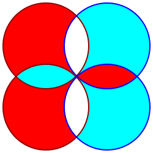
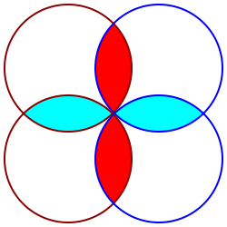

# Balanced Ternary Algebra

I have been unhappy with the existing [Three-valued logic](https://en.wikipedia.org/wiki/Three-valued_logic) which is usually true, unknown, and false. I have been trying to derive a form of logic which would better represent balanced ternary numbers, with positive, zero, and negative.

The purpose behind this is to find a [balanced ternary](https://en.wikipedia.org/wiki/Balanced_ternary) analog for a [boolean algebra](https://en.wikipedia.org/wiki/Boolean_algebra). This can be used to develop logic gates which handle positive and negative electric flows for a balanced ternary computer. It can take advantage of 3 having the most efficient [radix economy](https://en.wikipedia.org/wiki/Radix_economy).

Whenever I bring up this topic, people are quick to interpret it from a logic perspective, and run into philosophical problems. I think that actually has been holding 3 value logic back from being useful. That's why I am starting from an algebraic perspective, to make it useful first, and only afterward see how the result can be logically interpreted.

Let's see if we can use boolean algebra as an analog for balanced ternary algebra.

## Addition

In electric circuits, addition between bits is split into two parts - The sum, and the carry.

Lets take a look at balanced ternary addition:

| A | B | => | Carry | Sum |
|:-:|:-:|:-:|:-:|:-:|
| - | - | => | - | + |
| - | - | => | - | + |
| - | 0 | => | 0 | - |
| - | + | => | 0 | 0 |
| 0 | - | => | 0 | - |
| 0 | 0 | => | 0 | 0 |
| 0 | + | => | 0 | + |
| + | - | => | 0 | 0 |
| + | 0 | => | 0 | + |
| + | + | => | + | - |
| + | + | => | + | - |

Here becomes the truth table for balanced ternary addition:

| SUM | - | 0 | + |
|:-:|:-:|:-:|:-:|
| **-** | + | - | 0 |
| **0** | - | 0 | + |
| **+** | 0 | + | - |

It is both commutative and associative.

| CARRY | - | 0 | + |
|:-:|:-:|:-:|:-:|
| **-** | - | 0 | 0 |
| **0** | 0 | 0 | 0 |
| **+** | 0 | 0 | + |

It is both commutative and associative.

Now, to make the a bit more complicated, if we were to implement a full adder, we can try to use the formula used boolean algebra for the Carry:

    (A AND B) OR (Old Carry AND (A XOR B))

Experimenting a bit, I found with our balanced ternary truth tables, the boolean AND can be replaced with CARRY. XOR and OR can be resplaced with SUM. Here is the balanced ternary algebra for a full adder:

    Sum = A SUM B SUM Old Carry
    New Carry = (A CARRY B) SUM (Old Carry CARRY (A SUM B))

Using this formula with our newly defined ternary algebra, results in this table:

| Old Carry | A | B | = | New Carry | Sum |
|:-:|:-:|:-:|:-:|:-:|:-:|
| - | - | - |   | - | 0 |
| - | - | 0 |   | - | + |
| - | - | + |   | 0 | - |
| - | 0 | - |   | - | + |
| - | 0 | 0 |   | 0 | - |
| - | 0 | + |   | 0 | 0 |
| - | + | - |   | 0 | - |
| - | + | 0 |   | 0 | 0 |
| - | + | + |   | 0 | + |
| 0 | - | - |   | - | + |
| 0 | - | 0 |   | 0 | - |
| 0 | - | + |   | 0 | 0 |
| 0 | 0 | - |   | 0 | - |
| 0 | 0 | 0 |   | 0 | 0 |
| 0 | 0 | + |   | 0 | + |
| 0 | + | - |   | 0 | 0 |
| 0 | + | 0 |   | 0 | + |
| 0 | + | + |   | + | - |
| + | - | - |   | 0 | - |
| + | - | 0 |   | 0 | 0 |
| + | - | + |   | 0 | + |
| + | 0 | - |   | 0 | 0 |
| + | 0 | 0 |   | 0 | + |
| + | 0 | + |   | + | - |
| + | + | - |   | 0 | + |
| + | + | 0 |   | + | - |
| + | + | + |   | + | 0 |

This formula exactly matches ternary addition between 3 numbers. Awesome.

But how to handle negation?

## Subtraction

Something of interest in boolean algebra, is that NOT is not the same thing as negation. To perform negation, computers usually have to perform [Two's complement](https://en.wikipedia.org/wiki/Two%27s_complement), where you first do NOT, and then add one.

This algebra might be simpler with balanced ternary, because the negative of any balanced ternary number simply involves flipping around the signs. For example the negative of +-0- is -+0+. The concept of being negative, is built into balanced ternary. If we define NOT as follows, then it will equal negation:

| X | NOT(X) |
|:-----:|:------:|
| **-** | + |
| **0** | 0 |
| **+** | - |

Electrically, building this gate can be extremely simple - Just reverse the input wires. Positive becomes negative, negative becomes positive. Neutral stays the same.

The sum was defined as A SUM B. So in subtraction to find a difference, we would negate B, hence do A SUM NOT(B):

| Difference | - | 0 | + |
|:-:|:-:|:-:|:-:|
| **-** | 0 | - | + |
| **0** | + | 0 | - |
| **+** | - | + | 0 |

(A is vertical rows, B is horizontal columns)

The carry was defined as A CARRY B. So in subtraction to find a difference, we would negate B, hence do A CARRY NOT(B):

| Borrow | - | 0 | + |
|:-:|:-:|:-:|:-:|
| **-** | 0 | 0 | - |
| **0** | 0 | 0 | 0 |
| **+** | + | 0 | 0 |

Awesome! Now let's take the previous formula for a full adder:

* Sum = A SUM B SUM Old Carry
* New Carry = (A CARRY B) SUM (Old Carry CARRY (A SUM B))

And convert it to a full subtractor:

* Difference = Old Borrow SUM A SUM NOT(B)
* New Borrow = (A CARRY NOT(B)) SUM (Old Borrow CARRY (A SUM NOT(B)))

This reveals the full subtractor table:

| Old Borrow | A | B | = | New Borrow | Difference |
|:-:|:-:|:-:|:-:|:-:|:-:|
| - | - | - |   | 0 | - |
| - | - | 0 |   | - | + |
| - | - | + |   | - | 0 |
| - | 0 | - |   | 0 | 0 |
| - | 0 | 0 |   | 0 | - |
| - | 0 | + |   | - | + |
| - | + | - |   | 0 | + |
| - | + | 0 |   | 0 | 0 |
| - | + | + |   | 0 | - |
| 0 | - | - |   | 0 | 0 |
| 0 | - | 0 |   | 0 | - |
| 0 | - | + |   | - | + |
| 0 | 0 | - |   | 0 | + |
| 0 | 0 | 0 |   | 0 | 0 |
| 0 | 0 | + |   | 0 | - |
| 0 | + | - |   | + | - |
| 0 | + | 0 |   | 0 | + |
| 0 | + | + |   | 0 | 0 |
| + | - | - |   | 0 | + |
| + | - | 0 |   | 0 | 0 |
| + | - | + |   | 0 | - |
| + | 0 | - |   | + | - |
| + | 0 | 0 |   | 0 | + |
| + | 0 | + |   | 0 | 0 |
| + | + | - |   | + | 0 |
| + | + | 0 |   | + | - |
| + | + | + |   | 0 | + |

This is the same Old Carry + A - B with balanced ternery.

Two's compliment is not necessary. With this balanced ternary algebra, NOT is negation.

## Multiplication

Multiplication is relatively straightforward:

* +1 * +1 = +1
* -1 * -1 = +1
* -1 * +1 = -1
* +1 * -1 = -1
* Anything multiplied by 0 is 0

There is no "carry" in this multiplication.

| MULT | - | 0 | + |
|:-:|:-:|:-:|:-:|
| **-** | + | 0 | - |
| **0** | 0 | 0 | 0 |
| **+** | - | 0 | + |

It is both commutative and associative.

Interesting note - Just like multiplication with regular numbers can distribute into addition, the same can be done with this gates:

    A MULT (B SUM C) = (A MULT B) SUM (A MULT C)

A bit of experimentation with the truth tables reveals:

    A CARRY B = NOT(A MULT B MULT (A SUM B))

Reviewing the full adder carry from before:

    New Carry = (A CARRY B) SUM (Old Carry CARRY (A SUM B))

A bit of experimentation reveals we can replace it with:

    New Carry = NOT((A SUM B) MULT (A SUM C) MULT (B SUM C))

This is nice because the symmetry is readily apparent.

## Conclusion

I think establishing this balanced ternary algebra is a good first step towards building a balanced ternary computer.

If you are interested, I built a simple library using these gates here - [gates.rs](https://github.com/veniamin-ilmer/math/blob/master/balanced-ternary-algebra/gates.rs)

It would be nice to try and build these gates with transistors.
