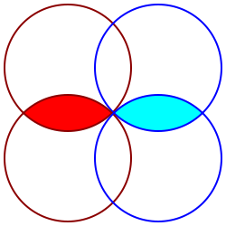
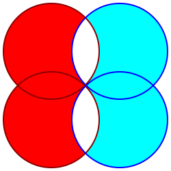
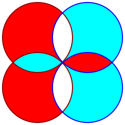

# Balanced Ternary Logic

I have been unhappy with the existing [Three-valued logic](https://en.wikipedia.org/wiki/Three-valued_logic) which is usually true, unknown, and false. I have been trying to derive a form of logic which would better represent balanced ternary numbers, with positive, zero, and negative.

The purpose behind this is to find a [balanced ternary](https://en.wikipedia.org/wiki/Balanced_ternary) analog for a [binary adder](https://en.wikipedia.org/wiki/Adder_(electronics)). This can be used to develop logic gates which handle positive and negative electric flows for a balanced ternary computer. It can take advantage of 3 having the most efficient [radix economy](https://en.wikipedia.org/wiki/Radix_economy).

Let's see if we can use binary logic gates as an analog for balanced ternary gates.

## Addition

In electric circuits, addition between bits is split into two parts - The sum, and the carry.

The sum of two bits can be calculated by using the XOR gate.

The carry of two bits can be calculated by using the AND gate.

Here is the truth table of balanced ternary addition:

| Sum | - | 0 | + |
|:-:|:-:|:-:|:-:|
| **-** | + | - | 0 |
| **0** | - | 0 | + |
| **+** | 0 | + | - |

Let's try to define sum as XOR.

| Carry | - | 0 | + |
|:-:|:-:|:-:|:-:|
| **-** | - | 0 | 0 |
| **0** | 0 | 0 | 0 |
| **+** | 0 | 0 | + |

Let's try to define the carry as AND.

Now, to make the a bit more complicated, if we were to implement a full adder, we can copy the formula used binary logic gates, however they require an OR.

Using intuition and a bit of experimentation, I have defined OR as follows:

| OR | - | 0 | + |
|:-:|:-:|:-:|:-:|
| **-** | - | - | 0 |
| **0** | - | 0 | + |
| **+** | 0 | + | + |

Here is the binary logic for a full adder:

* Sum = A XOR B XOR Old Carry
* New Carry = (A AND B) OR (Old Carry AND (A XOR B))

Using the same formulas with our newly defined ternary logic, results in this table:

| A | B | Old Carry | = | New Carry | Sum |
|:-:|:-:|:-:|:-:|:-:|:-:|
| - | - | - |   | - | 0 |
| - | - | 0 |   | - | + |
| - | - | + |   | 0 | - |
| - | 0 | - |   | - | + |
| - | 0 | 0 |   | 0 | - |
| - | 0 | + |   | 0 | 0 |
| - | + | - |   | 0 | - |
| - | + | 0 |   | 0 | 0 |
| - | + | + |   | 0 | + |
| 0 | - | - |   | - | + |
| 0 | - | 0 |   | 0 | - |
| 0 | - | + |   | 0 | 0 |
| 0 | 0 | - |   | 0 | - |
| 0 | 0 | 0 |   | 0 | 0 |
| 0 | 0 | + |   | 0 | + |
| 0 | + | - |   | 0 | 0 |
| 0 | + | 0 |   | 0 | + |
| 0 | + | + |   | + | - |
| + | - | - |   | 0 | - |
| + | - | 0 |   | 0 | 0 |
| + | - | + |   | 0 | + |
| + | 0 | - |   | 0 | 0 |
| + | 0 | 0 |   | 0 | + |
| + | 0 | + |   | + | - |
| + | + | - |   | 0 | + |
| + | + | 0 |   | + | - |
| + | + | + |   | + | 0 |

This formula exactly matches ternary addition between 3 numbers. Awesome.

But how to handle negation?

## Subtraction

Something of interest in binary logic, is that NOT is not the same thing as negation. To perform negation, computers usually have to perform [Two's complement](https://en.wikipedia.org/wiki/Two%27s_complement), where you first do NOT, and then add one.

This logic might be simpler with balanced ternary, because the negative of any balanced ternary number simply involves flipping around the signs. For example the negative of +-0- is -+0+. The concept of being negative, is built into balanced ternary, which may make its use simpler within logic gates. If we define NOT as follows, then it will equal negation:

| Input | Output |
|:-----:|:------:|
| **-** | + |
| **0** | 0 |
| **+** | - |

The sum was defined as A XOR B. So in subtraction to find a difference, we would negate B, hence do A XOR NOT(B):

| Difference | - | 0 | + |
|:-:|:-:|:-:|:-:|
| **-** | 0 | + | - |
| **0** | - | 0 | + |
| **+** | + | - | 0 |

The carry was defined as A AND B. So in subtraction to find a difference, we would negate B, hence do A AND NOT(B):

| Borrow | - | 0 | + |
|:-:|:-:|:-:|:-:|
| **-** | 0 | 0 | + |
| **0** | 0 | 0 | 0 |
| **+** | - | 0 | 0 |

Awesome! Now let's take the previous formula for a full adder:

* Sum = A XOR B XOR Old Carry
* New Carry = (A AND B) OR (Old Carry AND (A XOR B))

And convert it to a full subtractor:

* Difference = A XOR NOT(B) XOR NOT(Old Borrow)
* New Borrow = (A AND NOT(B)) OR (NOT(Old Borrow) AND (A XOR NOT(B)))

This reveals the full subtractor table:

| A | B | Old Borrow | = | New Borrow | Difference |
|:-:|:-:|:-:|:-:|:-:|:-:|
| - | - | - |   | - | 0 |
| - | - | 0 |   | - | 0 |
| - | - | + |   | 0 | 0 |
| - | 0 | - |   | - | 0 |
| - | 0 | 0 |   | 0 | 0 |
| - | 0 | + |   | 0 | - |
| - | + | - |   | 0 | 0 |
| - | + | 0 |   | 0 | - |
| - | + | + |   | 0 | - |
| 0 | - | - |   | - | + |
| 0 | - | 0 |   | 0 | 0 |
| 0 | - | + |   | 0 | 0 |
| 0 | 0 | - |   | 0 | 0 |
| 0 | 0 | 0 |   | 0 | 0 |
| 0 | 0 | + |   | 0 | 0 |
| 0 | + | - |   | 0 | 0 |
| 0 | + | 0 |   | 0 | 0 |
| 0 | + | + |   | + | - |
| + | - | - |   | 0 | + |
| + | - | 0 |   | 0 | + |
| + | - | + |   | 0 | 0 |
| + | 0 | - |   | 0 | + |
| + | 0 | 0 |   | 0 | 0 |
| + | 0 | + |   | + | 0 |
| + | + | - |   | 0 | 0 |
| + | + | 0 |   | + | 0 |
| + | + | + |   | + | 0 |

This formula exactly matches ternary subtraction between 3 numbers! Yey!

Two's compliment is not necessary. With this balanced ternary logic, NOT is negation.

## Discussion

Now that we have derived each logic gate, let's dive into each one:

### NOT

| X | NOT(X) |
|:-----:|:------:|
| **-** | + |
| **0** | 0 |
| **+** | - |

The NOT operation flips negativity to positivity and vice versa, with neutrality remaining unchanged. This is straightforward in terms of inversion but interesting in that zero remains an immutable neutral state. From the perspective of direct electric flow, this makes sense because direct current can only flow forward, or backward or not at all. It is not possible for electricity to flow backward and forward at the same time.

### AND

| AND | - | 0 | + |
|:-:|:-:|:-:|:-:|
| **-** | - | 0 | 0 |
| **0** | 0 | 0 | 0 |
| **+** | 0 | 0 | + |

* Negative AND Negative = Negative: This suggests that two negative statements together reinforce the negativity.
* Positive AND Positive = Positive: Similarly, two positive statements together reinforce positivity.
* Any other variant AND'd = Zero: This implies that any uncertainty (introduced by a mix of values) results in a neutral or undefined outcome.

### OR

| OR | - | 0 | + |
|:-:|:-:|:-:|:-:|
| **-** | - | - | 0 |
| **0** | - | 0 | + |
| **+** | 0 | + | + |

The OR operation seems to prioritize negativity and positivity under certain conditions but defaults to neutrality when positive and negative are combined. This suggests an interesting perspective where certain combinations of truth values neutralize each other, rather than emphasizing the most "positive" or "negative" outcome.

### XOR

| XOR | - | 0 | + |
|:-:|:-:|:-:|:-:|
| **-** | + | - | 0 |
| **0** | - | 0 | + |
| **+** | 0 | + | - |

* Negative XOR Negative = Positive: This could be interpreted as two negatives leading to a positive outcome when their exclusivity is considered, perhaps suggesting opposition or inversion
* Zero with anything results in the other value or remains Zero, which maintains the notion of neutrality or the lack of change unless opposed.
* Positive XOR Positive = Negative: This is particularly intriguing, suggesting that two positives, when exclusively considered, result in a negative. This could imply a concept of excess or conflict between positive forces.

## Conclusion

I think this is a good first step towards building a balanced ternary computer.

If you are interested, I built a simple library using these gates here - [https://github.com/veniamin-ilmer/math/blob/master/balanced-ternary-logic/gates.rs](https://github.com/veniamin-ilmer/math/blob/master/balanced-ternary-logic/gates.rs)

It would be nice to try and built these logic gates with transistors.
