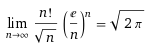

# PI Limit Representation

Checking online, I couldn't find any simple pi limit representations. Usually they involve a sum or product of numbers, but not a simple limit.

The best I found was [wolfram's PI limit representations](http://functions.wolfram.com/Constants/Pi/09/), which seemed overly complicated.

I've noticed all limit representations take advantage of the following property:

After a bit of analysis, I found much simpler ways to get PI with limits to infinity.

## Limits of sqrt(2π)

There are multiple ways to display the same thing. Find your favorite variant.

## Exponentation

Using , we can plug in our π limits, to get this:

