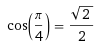
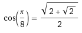
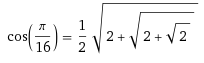
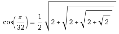
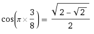
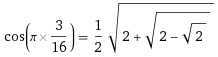
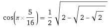
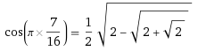

# Trigonometric Nested Radicals

I wondered for a while, why are 30 degree, 45 degree, 60 degree, and 90 degree angles so special.

Why do they have such simple cosines and sines, and why are all the other angles significantly more complicated?

I've been trying to solve this for a while. The results are quite revealing.

Starting off with a few curiosities..

## Nested examples

You can test, this pattern will continue to be true for future cases.

Indeed, I found increasingly, that a lot of sines and cosines can be expressed as adding or subtracting nested radicals of 2:

There are too many of these to be a coincidence..

Perhaps one can generate a nested radical solution for all rational sines and cosines?

## Nested Radical Algorithm

Yep, I after many hours studying this thing, I figured out the algorithm to generate a solution for any rational sine or cosine.

### Step 1

List all integers from 0 to the denominator.

Using cos(pi / 8) as an example:

|  |  |  |  |  |  |  |  |  |
| --- | --- | --- | --- | --- | --- | --- | --- | --- |
| 0 | 1 | 2 | 3 | 4 | 5 | 6 | 7 | 8 |

On the next row, start with the last number, (in this case 8), and keep subtracting 2.

If you get a negative number, take the absolute value:

|  |  |  |  |  |  |  |  |  |
| --- | --- | --- | --- | --- | --- | --- | --- | --- |
| 0 | 1 | 2 | 3 | 4 | 5 | 6 | 7 | 8 |
| 8 | 6 | 4 | 2 | 0 | 2 | 4 | 6 | 8 |

Now split this table in half. The left side is positive. The right side is positive.

If there is a zero in the middle, it's plus or minus.

| + | + | + | + | ± | - | - | - | - |
| --- | --- | --- | --- | --- | --- | --- | --- | --- |
| 0 | 1 | 2 | 3 | 4 | 5 | 6 | 7 | 8 |
| 8 | 6 | 4 | 2 | 0 | 2 | 4 | 6 | 8 |

### Step 2

The top number row will be used as a key for this lookup table. The bottom row number will be used as a value to find the next key. The pluses and minuses will be added into the nested radical as we move through the table.

Continuing with sin(pi * 1 / 8) as the example, the numerator in this case is **1**.

So in our table, we start out with **1** in the top row. We highlight the whole column:

| + | **+** | + | + | ± | - | - | - | - |
| --- | --- | --- | --- | --- | --- | --- | --- | --- |
| 0 | ***1*** | 2 | 3 | 4 | 5 | 6 | 7 | 8 |
| 8 | **6** | 4 | 2 | 0 | 2 | 4 | 6 | 8 |

Starting off, we see that we are on the positive side of the table.

So we start with positive root 2:

Next, we will use the **6** from the bottom row as a key in the next lookup:

| + | + | + | + | ± | - | ## - | - | - |
| --- | --- | --- | --- | --- | --- | --- | --- | --- |
| 0 | 1 | 2 | 3 | 4 | 5 | ***6*** | 7 | 8 |
| 8 | 6 | 4 | 2 | 0 | 2 | **4** | 6 | 8 |

Now, we are on the negative side of the table.

So we update our example:

Next, we will use the **4** from the bottom row as a key in the next lookup:

| + | + | + | + | **±** | - | - | - | - |
| --- | --- | --- | --- | --- | --- | --- | --- | --- |
| 0 | 1 | 2 | 3 | ***4*** | 5 | 6 | 7 | 8 |
| 8 | 6 | 4 | 2 | **0** | 2 | 4 | 6 | 8 |
