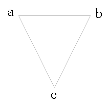
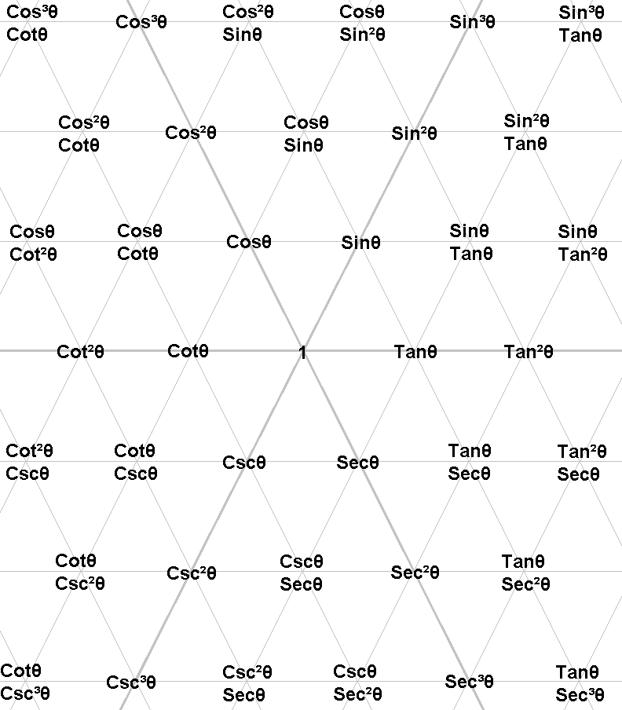
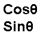
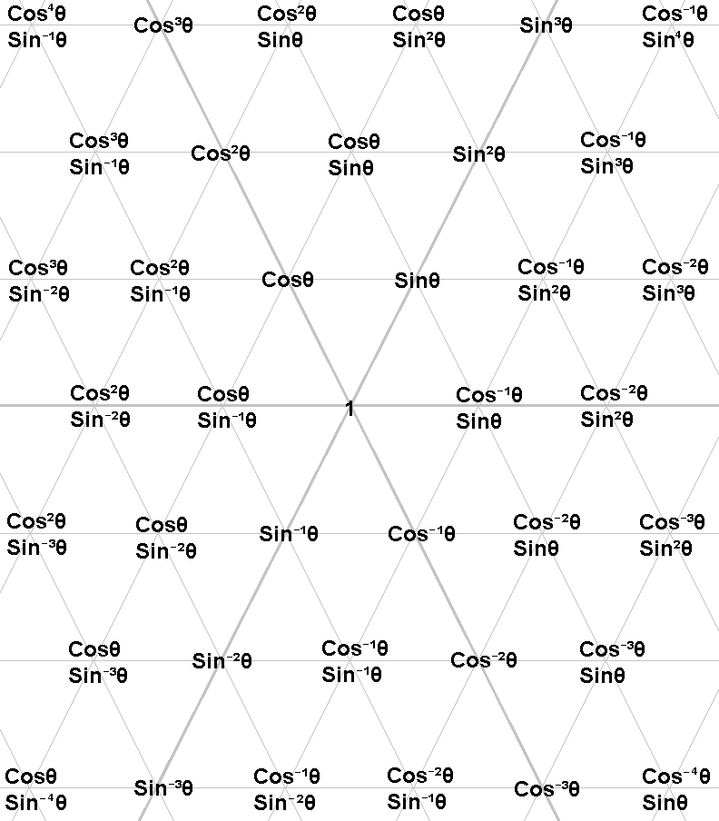
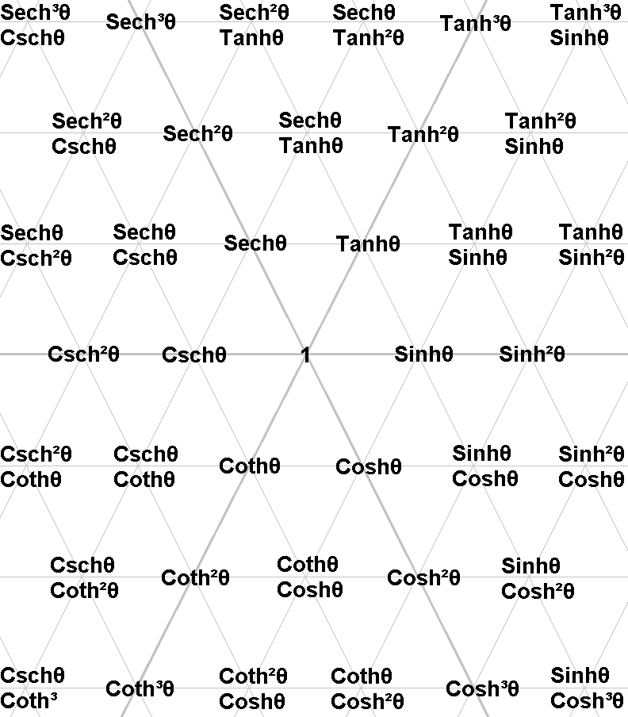
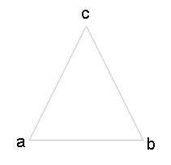
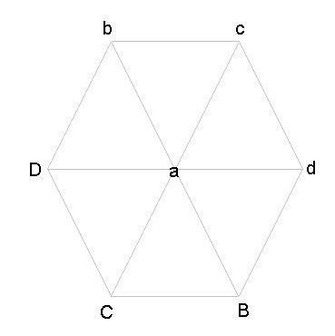

# Trigonometric Tiling

Playing around with triangles and hexagons, I found an infinite set of trigonometric identities, that fit neatly on a triangle tile.

I didn't find this trigonometric tiling online, so I decided to share it with everyone.

## Definition

For all triangles used in the tiling on this page:

### a2 + b2 = c2

Please note, the points have nothing to do with the triangle lengths or angles. The triangles just provide a neat way of showing all the points.

In all of the tiled triangles below, the top left point squared plus top right point squared equal the bottom point squared.

## Trigonometric Tile

Please read the multiline

as **cos θ * sin θ**.

## Example of identities from tiling

### sin2θ + cos2θ = 1
### 1 + tan2θ = sec2θ
### cot2θ + 1 = csc2θ
### csc2θ + sec2θ = csc2θ sec2θ
### cos2θ sin2θ + sin4θ = sin2θ

This trigonometric identity diagram can be extended infinitely in all directions (sin, cos, tan, csc, sec, cot).

## Simplified Trigonometric Tile

The tile can be rewritten to use just Sine and Cosine:

The exponent of each point can be converted from cartesian coordinates for any point:

**coscθ * sinsθ**

    c = (y - x) / 2

    s = (y + x) / 2

## Proof

The pattern we see in the tiling:

(f(x)a + 1 * g(x)b)2 + (f(x)a * g(x)b + 1)2 = (f(x)a * f(x)b)2

is only true if the following is valid:

f(x)2 + g(x)2 = 1

Hence, the tiling can also be doing for hyberbolic functions too.

## Hyperbolic Tile

## More Properties

Here are a few more useful properties I found..

For all triangles:

### a-2 + b-2 = c-2

--

For all hexagons:

### a2 = bB = cC = dD

--

For all triangles:

### a + b = c

## Acknowledgements

I got the idea to build this tiling after watching the video [Super Hexagon](https://www.youtube.com/watch?v=T7D1W1oD8wo).

I don't know who the original author of the "Super Hexagon" is, but it looks like it's used in some schools as a learning tool to help students with trigonometry.
